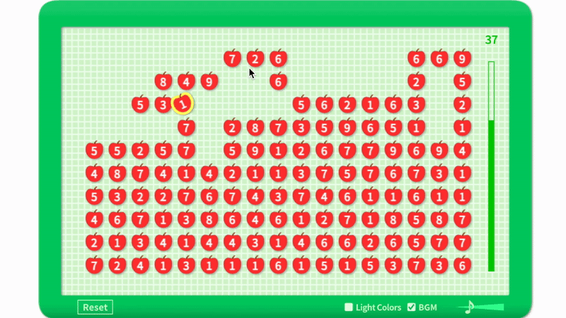
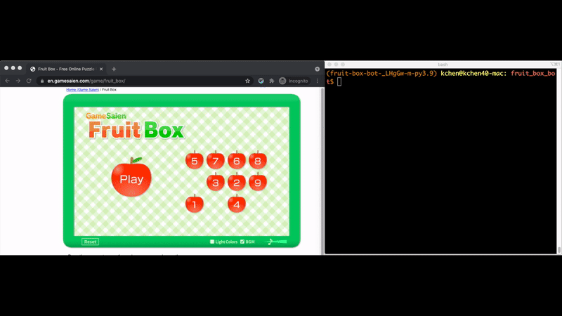

Fruit box bot
=============

A bot that plays the [Fruit Box game](https://en.gamesaien.com/game/fruit_box/), where you are
given a grid of apples, each with a number, and must repeatedly make boxes that enclose apples
summing to exactly 10.

Demo Video
----------

Here is a video with a perfect score of 170!

Usage
-----

This bot uses Python 3 and Rust.

This was tested on Chrome 110 on OS X 13.2.1. In particular, taking screenshots of the Apple retina
display gives images that are twice the expected size. On devices without the retina display, set
`SCALE = 1` [here](main.py#L9).

- In the root directory, run `poetry shell` followed by `maturin develop`.
- Go to https://en.gamesaien.com/game/fruit_box/.
- Run `python main.py`.

Credits
-------

Thanks to [GameSaien](https://en.gamesaien.com/) for creating this game and to
[this puzzle from Galactic Puzzle Hunt](https://2020.galacticpuzzlehunt.com/puzzle/letter-boxing),
which is how I heard about it.

